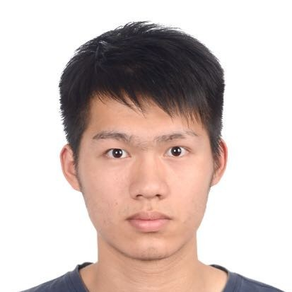

## Zijian Ling (凌子健）
------------------------------------------------------

Final year undergraduate in the University of Nottingham UK, major in Computer Science with Artificial Intelligence

I will be a research master student at [Imperial College London](https://www.imperial.ac.uk/) in 2022 Fall, major in MRes Artificial Intelligence and Machine Learning.

Email: georgeling.0330 [at] gmail.com or scyzl4 [at] exmail.nottingham.ac.uk

### Biography
---------------------------------
I am currently a final year undergraduate at the [University of Nottingham](https://www.nottingham.ac.uk), major in Computer Science with Artificial Intelligence. My dissertation is "Visual Tracking using Deep Learning", supervised by [Prof. Tony Pridmore](https://www.nottingham.ac.uk/computerscience/people/tony.pridmore). Before that, I have spent time as an intern with [Dr. Jibo He](https://www.psych.tsinghua.edu.cn/xlxxen/info/1071/1099.htm) at Tsinghua University, [Mr. Kun Wu](https://www.linkedin.com/in/kskywu/) at [Ant Group](https://www.antgroup.com/en), [Prof. Xi Li](https://person.zju.edu.cn/en/xilics) at Zhejiang University.

My ultimate research interests are computer vision and robotic perception with application to make machine understand the real world.

My current research interests:
- Deep Learning for Computer Vision
- Scene Understanding
- Robotics

Used to
- Deep learning for Time series analysis

<!-- I am recruited as a **part-time** machine learning engineer in a quantitative trading startup group in [SJTU](https://en.sjtu.edu.cn/)during the following summer  -->

### Education
--------------------------------

- University of Nottingham (UNUK)2020.09-2022.07(expected) 
  BSc (Hons) Computer Science with Artificial Intelligence   

- University of Nottingham Ningbo China(UNNC)2018.09-2020.07 
  BSc (Hons) Computer Science with Artificial Intelligence(2+2)  

### Experience
----------------------------------
- Xi Li' Lab, Zhejiang University, Hangzhou, China 2021.08-2021.10 
  Research Intern 
  Advisor: [Prof. Xi Li](https://person.zju.edu.cn/en/xilics) 
  Topic: Visual traking and 3D point cloud   

- Technology Risk Department, [Ant Group](https://www.antgroup.com/en), Hangzhou, China 2021.06-2021.08 
  Software Development Engineer Intern  
  Group Leader: [Mr. Kun Wu](https://www.linkedin.com/in/kskywu/) 
  Focus: Self-dependent fund risk identification system   

- Engineering Psychology Laboratory, Tsinghua University, Remote 2020.06-2020.12 
  Research Intern 
  Advisor:  [Dr. Jibo He](https://www.psych.tsinghua.edu.cn/xlxxen/info/1071/1099.htm) 
  Topic: Data mining on driving distraction detection   

### Publications
----------------------------
- Duoduo Hu, Annebella Tsz Ho Choi, Zijian Ling, Jibo HE. Detecting Driving Distraction: A Neural Network Model Using Wearable Devices (13th International Conference on Applied Human Factors and Ergonomics, AHFE 2022) [Project will be available soon]()

### Selected Projects
----------------------------
- I have post some source code on my [Github](https://github.com/Georgelingzj)
- [Tracker]

### Skills
-----------------------------
- Programming Language:
    Python, Java, C++, C   

- Framework:
  Tensorflow, PyTorch, Pandas, NumPy, Matplotlib, SOFA Boot   

- Data:
  MySQL, MyBatis   

- System:
  Git, Linux  

### Other Link
----------------------------
- Github: [https://github.com/Georgelingzj](https://github.com/Georgelingzj)
- Linkedin: [https://www.linkedin.com/in/zijian-ling-a761a71b7/](https://www.linkedin.com/in/zijian-ling-a761a71b7/)  

### About my life
-------------------------
I am from [Hangzhou](https://en.wikipedia.org/wiki/Hangzhou), a beautiful city in the southeast coast of China.

Sports I was/am excelled / love :
- sprint(100 m and 400 m, former player)
- Judo (former player)
- Basketball (for more than 10 years, former player)
- rowing (2018-2020, former player)
- Skiing

### Note
---------------------------

Last Visited: May. 8. 2022

